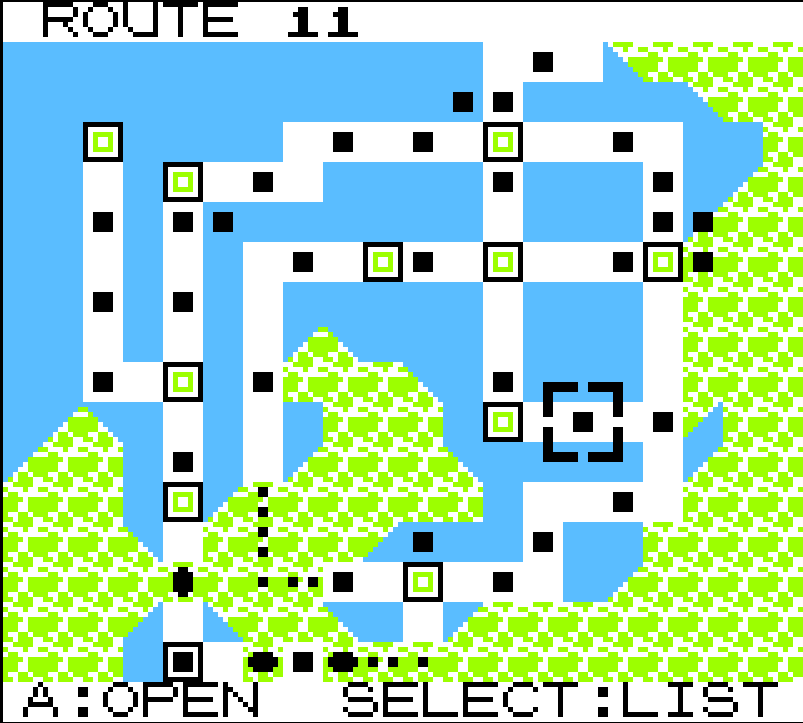
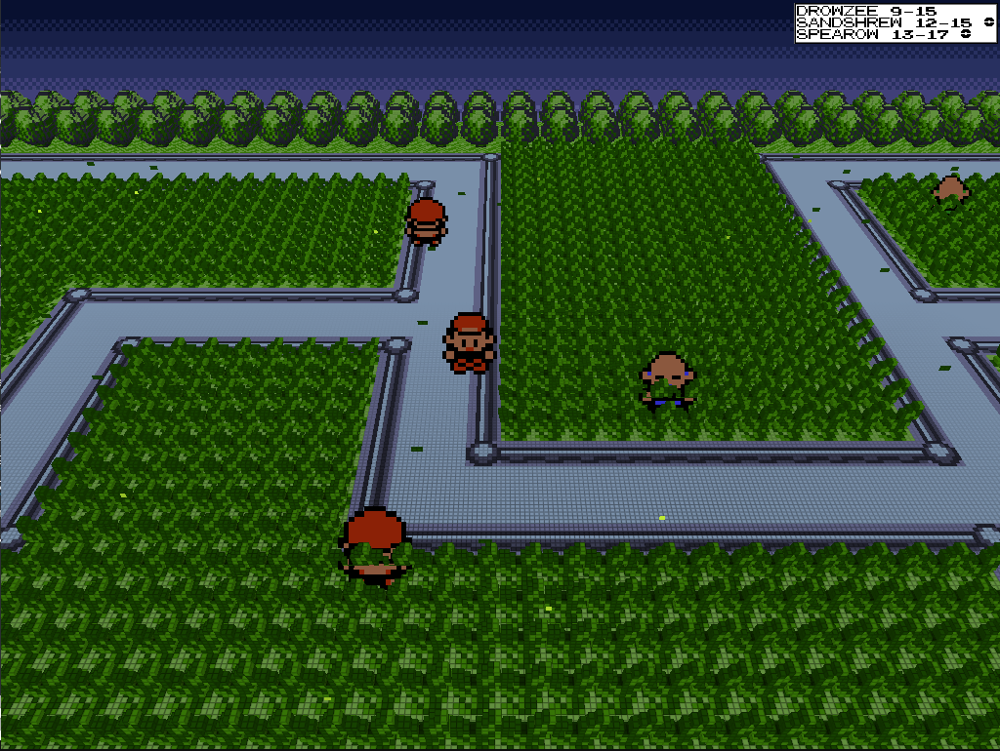
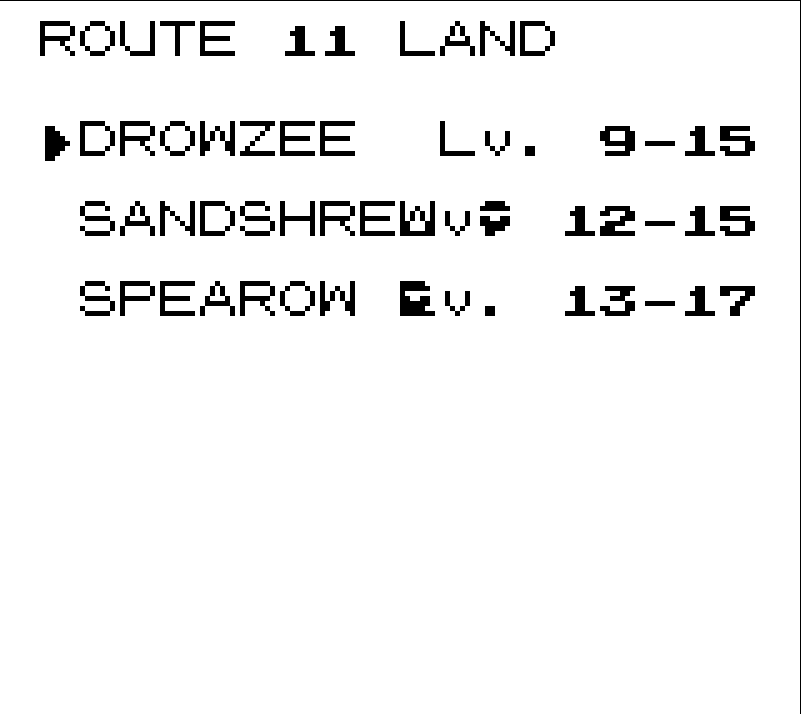

# 🗺️ Will's Mod

**A catch-'em-all toolkit for Gen1Recomp: a map-first wild-encounter guide and a battle HUD that shows which Pokémon you already own.**

Two read-only tools in one mod — know where to find every wild Pokémon, and know which ones you've already caught:

- **Encounter Guide** — walk the real Kanto Town Map, hop between encounter-bearing locations, and drill down to exact routes, floors, and buildings, with truthful level ranges and per-step odds derived from *your* imported ROM.
- **Battle HUD** — a Pokédex ball marker beside each battler's name when you've already caught that species.

    

---

## Screenshots

| PKMN MAP (Kanto) | Walking HUD | Encounter List |
|---|---|---|
|  |  |  |

## Features

### 🗺️ Encounter Guide

- **The real Kanto map** — artwork and coordinates come from your locally imported ROM. Nothing is bundled or redrawn.
- **Map-first navigation** — only locations with wild encounters are selectable; the cursor snaps between them.
- **Exact source identity** — floors, caves, gates, buildings, and Pokémon Centers are never blended. `-- MT. MOON 1F` stays honest about being an interior.
- **You are here** — a blinking white marker shows your current location on Kanto, even where that spot has no wild encounters.
- **Walking HUD** — while exploring, a top-right panel lists the current area's LAND and WATER species with their exact level ranges; it hides itself in menus and battles.
- **HUD modes** — AUTO (only while standing on grass or water, showing just that table), ALWAYS, or OFF, from the Options menu or the **H** key.
- **HUD sizes** — SMALL, MEDIUM, or LARGE from the Options menu (ENC. GUIDE SIZE).
- **Owned markers** — caught Pokémon carry the Pokédex ball, on the walking HUD and in every species list.
- **LAND and WATER as separate views** — no deceptive merged tables.
- **Compact level ranges, full odds on demand** — `ZUBAT Lv. 8-10` up top, then every exact level with its chance per movement step.
- **SELECT opens the complete list** — catches every encounter source, including any that lack Town Map coordinates.
- **Pure ROM-derived data** — works with Red, Blue, or Yellow; zero hard-coded species tables; no copyrighted content shipped.

### ⚪ Battle HUD

- **Owned-ball markers** — when a battler's species is in your Pokédex as caught, a Pokédex ball appears below-left of their name.
- **Fixed geometry** — markers are anchored to the name field, independent of name length, in both classic (160×144) and wide battle layouts.
- **Polite by default** — markers hide while the enemy is sending out, and in safari, demo, and player-back views.

## Install

1. Open **MODS** in Gen1Recomp (`F10` on desktop).
2. **Import mod .zip** and select `wills_mod-1.0.0.zip`.
3. Enable **Will's Mod**.

Works on desktop and Android. Requires an imported Pokémon Red, Blue, or Yellow ROM.

> 💡 Mods are loaded from the installed copy. After editing source, rebuild (`python3 tools/bundle.py`), repack, and re-import — tests alone don't update a running game.

## Usage

### Encounter Guide

| Input | Action |
|-------|--------|
| **D-pad** | Move between encounter-bearing locations on Kanto |
| **A** | Open the selected location's exact source maps |
| **A** (in lists) | Drill down: source → LAND/WATER → species → levels |
| **SELECT** | Jump to the complete location list (incl. unmapped sources) |
| **B** | Back one level |
| **H** | Cycle the walking HUD: AUTO → ALWAYS → OFF |

```text
START → PKMN MAP
  → KANTO MAP                (D-pad, A to select)
    → MT. MOON               (grouped Town Map marker)
      → -- MT. MOON 1F       (exact source, always separate)
        → LAND · WATER       (never merged)
          → ZUBAT  Lv. 8-10  (truthful compact range)
            → Lv. 8  · 1.95% (exact per-step odds)
```

### Battle HUD

Nothing to do — markers appear automatically once a battler's species is in your caught Pokédex.

## How it works

```text
your imported ROM
      │  (Gen1Recomp extraction)
      ▼
generated data  ──►  model.lua          ──►  screens (list + detail)
(encounters,      │   groups sources,        │
 field/townMap,   │   never merges maps,     ▼
 pokemon,         │   sums duplicate slots,  ListMenu UI (A open / B back)
 constants)       └── calculates odds        MapScreen (D-pad cursor)
                                              BattleHud (battle.overlay)
```

The mod is read-only: it never touches saves, encounter mechanics, or link state.

## Project layout

```text
.
├── main.lua               # self-contained release entry (generated)
├── lib/
│   ├── entry.lua          # screen registration + hook wraps          (source of truth)
│   ├── model.lua          # source grouping, methods, levels, buckets, odds
│   ├── names.lua          # player-facing map/source labels
│   ├── screens.lua        # ListMenu-based area/source/method/species screens
│   ├── map_screen.lua     # Town Map viewer: ROM tiles, cursor, markers, controls
│   ├── hud.lua            # walking HUD: per-area species panel via render.hud
│   └── battle_hud.lua     # battle owned-ball markers via battle.overlay
├── tools/bundle.py        # deterministic bundler: lib/ → main.lua
├── tests/                 # LÖVE test suite (11 files, fixtures + live Blue cache)
├── manifest.json          # mod metadata (id: wills_mod, github: illanrego/wills-mod)
├── mod.card               # launcher-facing description
└── dist/                  # importable release ZIPs
```

## Development

Requires any LÖVE 11+ runtime (the Gen1Recomp AppImage bundles one) plus the official [`modkit.py`](https://github.com/bryanthaboi/gen1recomp) tooling.

```sh
# run the test suite (fixtures + your imported Blue cache)
WILLS_MOD_ROOT="$PWD" love tests/runner

# regenerate main.lua after editing lib/
python3 tools/bundle.py

# official mod validation, ROM-content lint, and packaging
modkit validate --base fixture --strict .
modkit lint .
modkit pack -o dist/wills_mod-1.0.0.zip .
```

Every release gate runs before tagging: **11/11 test files green** → strict loader validation → no-ROM-content lint → clean archive → live in-game smoke test.

## Scope

- **Covered:** walking/LAND and Surf/WATER encounter tables; battle owned-markers.
- **Deferred (truthfully labeled later):** fishing, static encounters, gifts, trades, prizes, and Game Corner — each deserves its own honest acquisition method before it appears in the guide.

## Roadmap

- [x] v0.1.0 — Encounter Guide: exact-source area browser, LAND/WATER separation, odds
- [x] v0.2.0 — map-first Kanto navigation on ROM-generated artwork
- [x] v0.3.0 — PKMN MAP menu entry + blinking player-position marker
- [x] v0.4.0 — walking HUD with per-area species and level ranges
- [x] v0.5.0 — HUD modes (AUTO/ALWAYS/OFF + H key + options menu) and owned-ball markers
- [x] v0.6.0 — HUD size option (SMALL/MEDIUM/LARGE)
- [x] v0.1.0–0.1.5 — Battle HUD: owned-ball markers, fixed per-layout geometry
- [x] v1.0.0 — Will's Mod: both tools merged into one install
- [ ] Red/Yellow data pass on real caches
- [ ] Fishing as its own method

## Credits

- **[Gen1Recomp](https://github.com/bryanthaboi/gen1recomp)** — the decompiled-Gen-1 runtime, public mod API, and UI toolkit this mod is built on.
- **pret/pokered** — the original disassembly reference behind the data extraction.
- Built for Illan, who wanted to know what's in the tall grass *before* stepping in it — and which ones he still needs.
